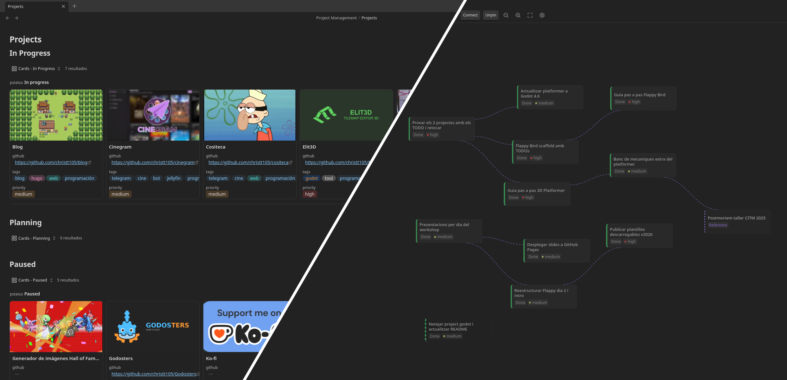
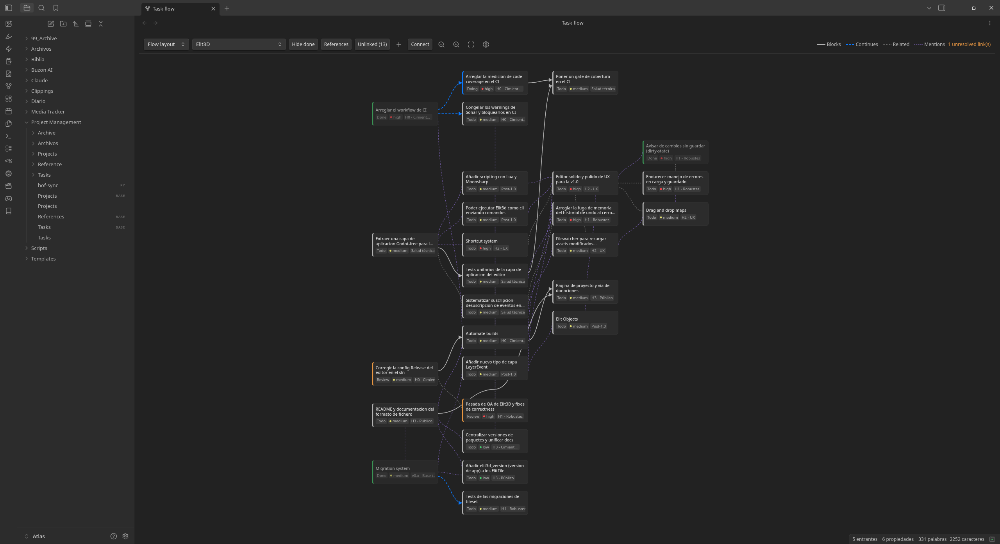
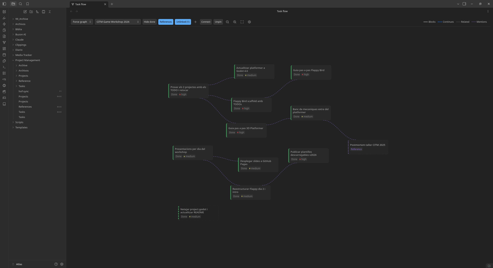
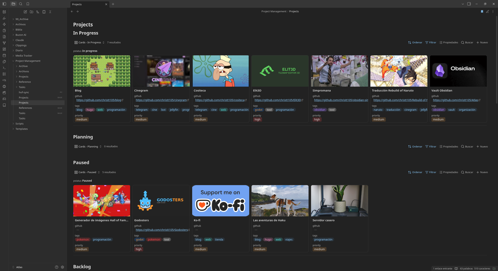
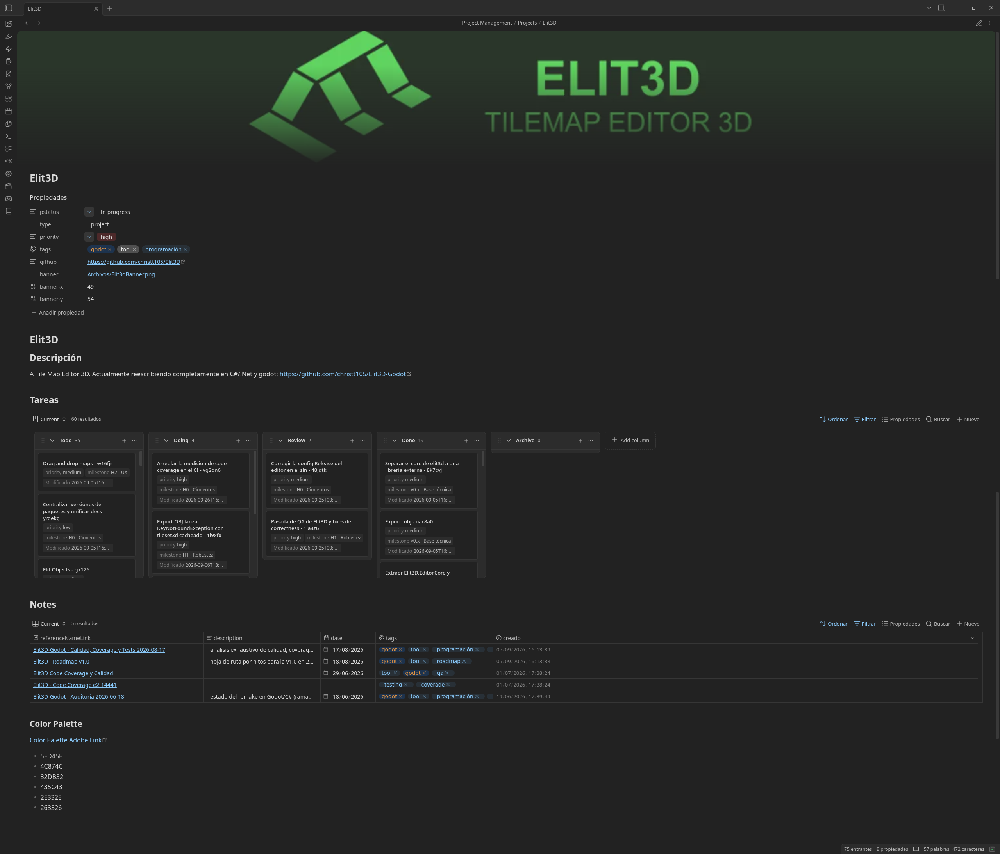
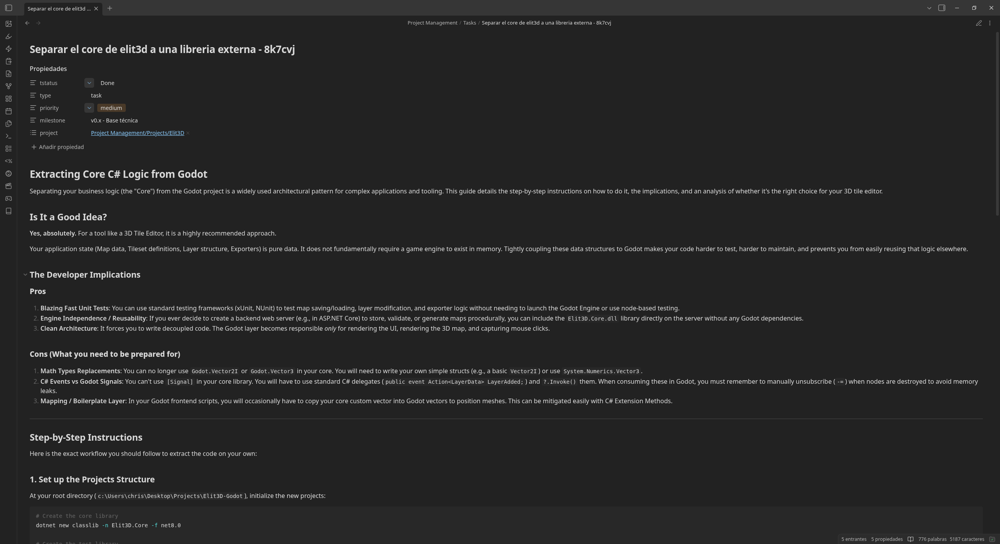
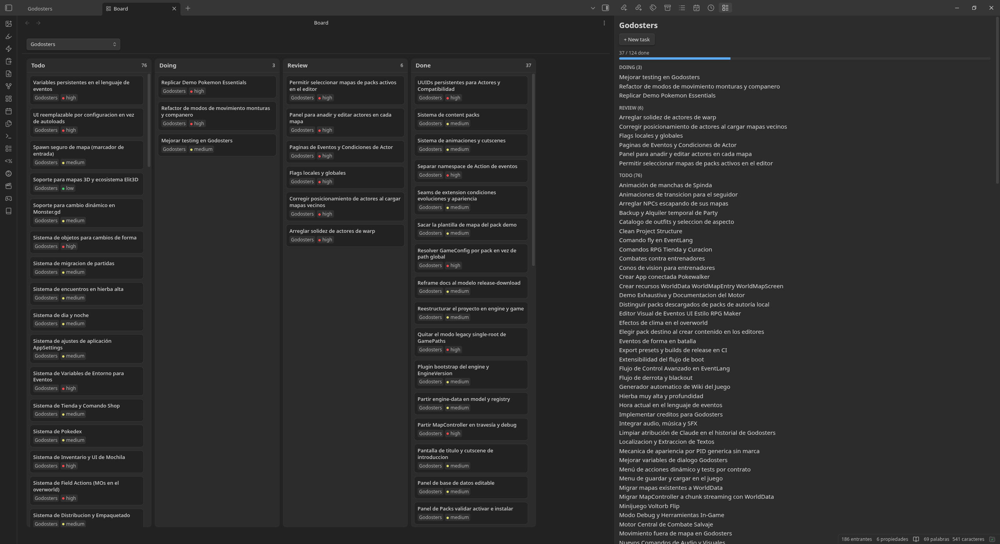
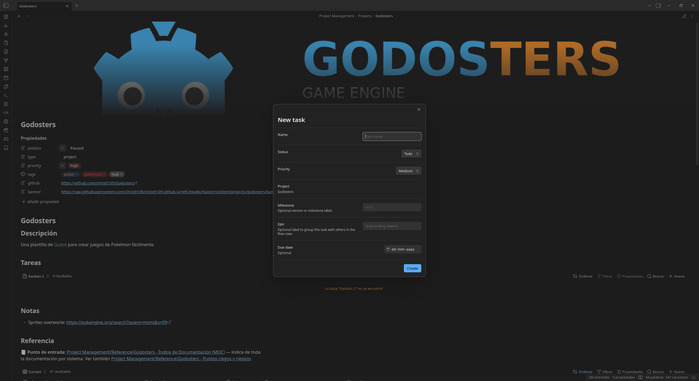

# Simpromana

An Obsidian plugin for project and task management: a task flow graph, a
kanban board, a project side panel, and commands to keep `Projects`,
`Tasks`, and `Reference` notes wired together through frontmatter.

## Features

- **Flow view**: a graph of tasks and their relations (`blocked_by`,
  `continues`, `related`), grouped and laid out automatically.
- **Board view**: a kanban board (Todo/Doing/Review/Done) with
  drag-and-drop status changes and an optional project filter.
- **Project panel**: a side panel listing a project's tasks by status,
  with quick task creation.
- **Commands**: *New project*, *New task*, *New reference*, and *Archive
  current task*, each scaffolding the right frontmatter.
- Works alongside the core **Bases** plugin: project notes embed
  `Tasks.base` and `References.base` views for their own tasks and
  references.

## Installation

**Community plugins (recommended)**

Open the [Simpromana page](https://community.obsidian.md/plugins/simpromana)
on the Obsidian community site and install it from there, or:

1. Open Settings → Community plugins → Browse.
2. Search for *Simpromana*, install it, and enable it.

**BRAT (pre-releases)**

1. Install the [BRAT](https://github.com/TfTHacker/obsidian42-brat) community plugin.
2. In BRAT, *Add beta plugin*, and enter `christt105/obsidian-simpromana-plugin`.
3. Enable Simpromana under Settings → Community plugins.

**Manual**

1. Download `main.js`, `manifest.json`, and `styles.css` from the
   [latest release](https://github.com/christt105/obsidian-simpromana-plugin/releases/latest).
2. Copy them into `<vault>/.obsidian/plugins/simpromana/`.
3. Enable Simpromana under Settings → Community plugins.

Release assets carry GitHub build provenance attestations, so you can
check they were built from this repository with
`gh attestation verify main.js --repo christt105/obsidian-simpromana-plugin`.

The frontmatter fields and folder conventions are opinionated, built
around how I personally organize my own vault.

## Requirements

- Obsidian 1.13.0+.
- The core **Bases** plugin, if you want the `Tasks.base` /
  `References.base` views embedded in project notes.
- Recommended: the community plugin **[Base Board](https://community.obsidian.md/plugins/base-board)**,
  which the generated `Tasks.base` views use. Without it, those views
  fall back to a plain table.

## Note types

- **`project`** (`Projects/*.md`): one per ongoing effort, created via
  *New project*.
- **`task`** (`Tasks/Title - abc123.md`): created via *New task*, with a
  `project` frontmatter link back to its parent project.
- **`reference`** (`Reference/Title - abc123.md`): write-ups and audits,
  created via *New reference*, also linked back to a `project`.

Frontmatter field names (`tstatus`, `pstatus`, `type`, relation keys) and
the status vocabulary (`Todo`/`Doing`/`Review`/`Done`) are fixed, not
configurable yet.

## Settings

Under Settings → Simpromana: the root folder and the `Projects` /
`Tasks` / `Reference` / `Archive` subfolder names.

## Privacy

Simpromana lists the notes in your vault to find projects, tasks, and
references by their `type` frontmatter, and edits their frontmatter
when you change a status or a relation. It makes no network requests;
nothing leaves your vault.

## Known limitations

- Frontmatter property names and status vocabulary are hardcoded across
  the plugin.
- The *Setup bases* command generates `Tasks.base` but not
  `References.base`; if a project note embeds it, create that file
  manually first.

## Screenshots

## License

Licensed under [MIT](LICENSE) License.
